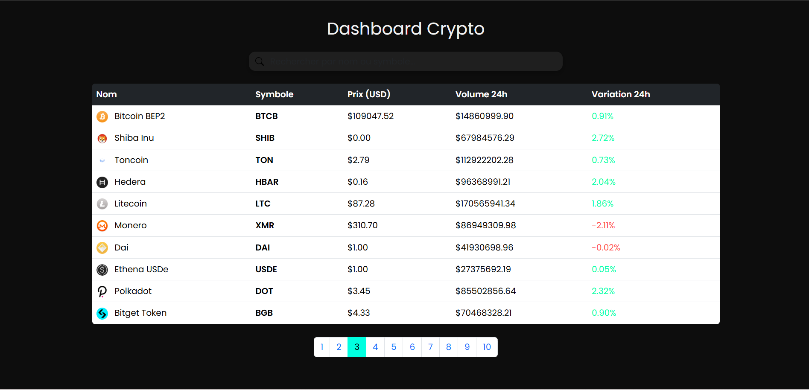

````markdown
# 🚀 Crypto ETL & Analytics Platform

Un projet complet d'ingénierie de données en Python pour l'extraction, la transformation et la visualisation de données de cryptomonnaies en temps réel.

---

## 📊 Présentation

Cette application permet de :

- Extraire des données de cryptomonnaies via l’API publique de [CoinCap](https://coincap.io/)
- Nettoyer et transformer les données avec `pandas`
- Stocker les données dans une base PostgreSQL
- Exposer une API REST avec `FastAPI`
- Visualiser les données via une interface web moderne en HTML/CSS (Jinja2)

---

## 🧱 Architecture

```plaintext
+--------------+       +------------------+      +-------------------+       +------------------+
| CoinCap API  | --->  | Script ETL (Python) | -> | PostgreSQL (Docker) | <-> | FastAPI REST API |
+--------------+       +------------------+      +-------------------+       +------------------+
                                                                          |
                                                                          v
                                                                  Interface Web (Jinja2)
````

---

## 🛠️ Technologies utilisées

* Python 3.11
* FastAPI
* SQLAlchemy & psycopg2
* Pandas
* PostgreSQL 14
* Docker & Docker Compose
* Jinja2 (interface web HTML)
* dotenv

---

## ⚙️ Lancer le projet

### 1. Cloner le dépôt

```bash
git clone https://github.com/marcellin-d/crypto-etl-project.git
cd crypto-etl-project
```

### 2. Créer le fichier `.env` à la racine avec la variable suivante :

```env
DB_URL=postgresql://postgres:postgres@db:5432/crypto
```

### 3. Lancer les services Docker

```bash
docker-compose up --build
```

* L'API est disponible sur : [http://localhost:8000](http://localhost:8000)
* L’interface web est accessible à la même adresse
* PostgreSQL tourne sur le port 5432

---

## 🌐 Interface Web

L’interface permet de visualiser les données extraites, triées et formatées dans un tableau élégant, prêt à être partagé avec vos collaborateurs ou clients.




---

## 📁 Structure du projet

```
.
├── app.py                   # Application FastAPI + Web
├── etl.py                   # Pipeline ETL
├── requirements.txt         # Dépendances Python
├── Dockerfile               # Backend API
├── Dockerfile.etl           # Pipeline ETL
├── docker-compose.yml       # Orchestration multi-services
├── .env                     # Variables d’environnement
├── templates/
│   └── index.html           # Interface utilisateur
└── README.md
```

---

## ✅ Fonctionnalités clés

* 🌐 API REST pour requêter les données
* 🔄 Pipeline ETL automatisé
* 📦 Stockage PostgreSQL conteneurisé
* 🖥️ Frontend web intégré
* 🐳 Déploiement facile avec Docker

---

## 💡 Améliorations futures

* Planification du pipeline avec Apache Airflow ou cron
* Export CSV/Excel depuis l’interface
* Authentification pour accéder à l’interface
* Dashboard avancé avec Streamlit ou Dash

---

## 👨‍💻 Auteur

Marcellin Djambo – Analytics Engineer
🔗 [LinkedIn](https://www.linkedin.com/in/marcellindjambo) • 📁 [GitHub](https://github.com/marcellin-d)

---
